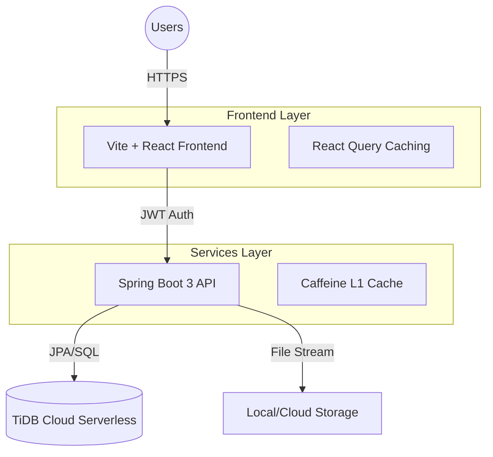
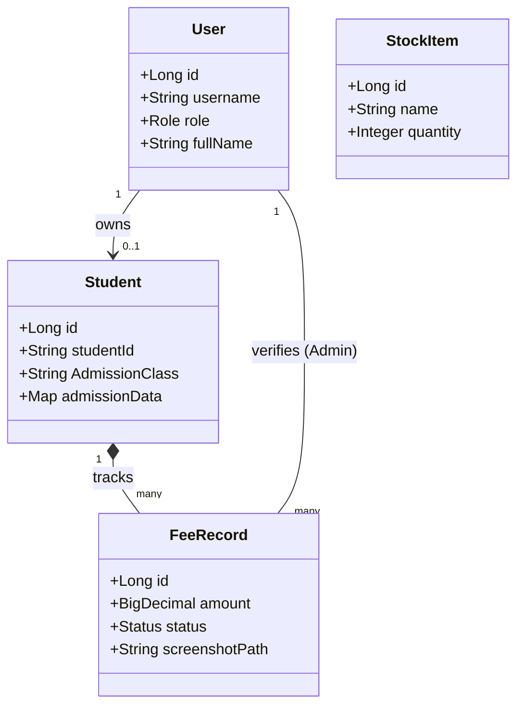
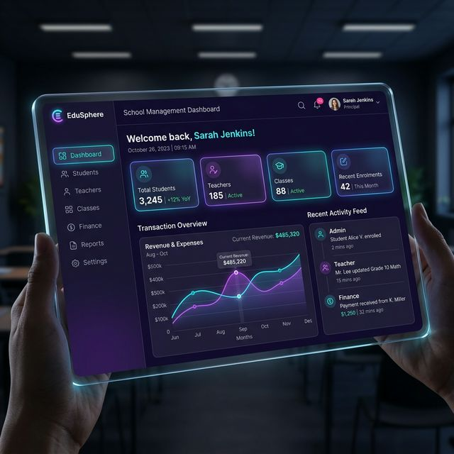

# Vision Public School (VPS) Management Portal

> A premium, fully-integrated management system for educational institutions, designed for performance, security, and a seamless user experience across all devices.

---

## 🏗️ High-Level Design (HLD)

The VPS system follows a modern multi-tier architecture, ensuring scalability and secure data management.

---

## 🛠️ Low-Level Design (LLD)

### Data Architecture

---

## 📱 User Workflows

### 👑 System Admin & Administrator
*   **User Management**: Provision new staff accounts, reset passwords, and manage permissions.
*   **Admissions**: Comprehensive 4-tab admission process including document uploads.
*   **Finances**: Global fee tracking, offline payment recording, and Profit/Loss analytics.
*   **Inventory**: Track school resources, issue items to staff, and monitor stock levels.

### 👩‍🏫 Staff (Teachers, Accountants, etc.)
*   **Teacher**: View relevant student details, post school-wide notices, and manage their own profile.
*   **Accountant**: Manage fee records, verify student payments, and track financial health.
*   **General Staff**: Access the dashboard and notice board for institutional updates.

### 🎓 Students
*   **Identity Profile**: View unified profile with all academic and personal details.
*   **Finance**: Pay fees online (with screenshot upload) and download automated PDF receipts.
*   **Announcements**: Real-time access to the institutional Notice Board.

---

## 📑 Standard Operating Procedure (SOP)

### 1. New Staff Setup
1.  Navigate to **User Management**.
2.  Click **Provision User**.
3.  Select the appropriate **Role** (ADMIN, TEACHER, etc.).
4.  Standardize username format: `vps.[firstname].[lastname]`.
5.  Notify staff of the default security key: `vps@123`.

### 2. Student Admission
1.  Open **Admissions** and fill out all four sections (Personal, Academic, Guardian, Medical).
2.  Upload the **Photograph** and **Required Documents**.
3.  Upon submission, the system automatically creates a student account.
4.  Download the **Admission Form PDF** for school records.

### 3. Fee Verification (Accountant)
1.  Check **Fee Management** for "PENDING" online payments.
2.  Open the payment record to view the **Verification Screenshot**.
3.  Cross-check with the bank/UPI statement.
4.  Approve the record to automatically generate an official PDF receipt for the student.

---

## 🚀 Technology Stack
*   **Frontend**: React 18, Vite, Framer Motion (for animations), Lucide React (icons), React Query v5.
*   **Backend**: Java 17, Spring Boot 3.2.3, Spring Security (JWT), Spring Data JPA.
*   **Database**: TiDB Cloud (MySQL-Compatible Distributed Database).
*   **Caching**: Caffeine Cache (L1 Cache for ultra-fast data retrieval).

---

## ⚙️ Installation & Setup

### Prerequisites
*   JDK 17 or higher
*   Node.js 18 or higher
*   MySQL/TiDB database instance

### Backend
1.  Configure `application.properties` with database URL and credentials.
2.  Run `./mvnw spring-boot:run`

### Frontend
1.  Install dependencies: `npm install`
2.  Set `VITE_API_URL` environment variable.
3.  Run `npm run dev`

---

*Built with ❤️ for Vision Public School Management.*
